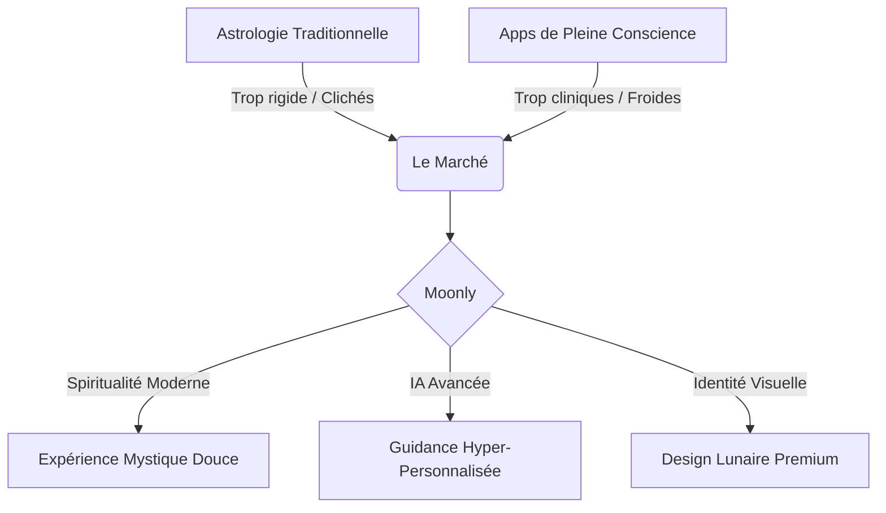
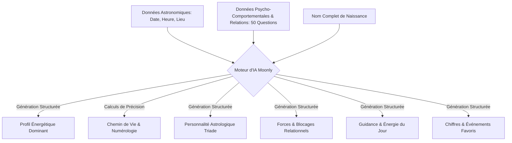
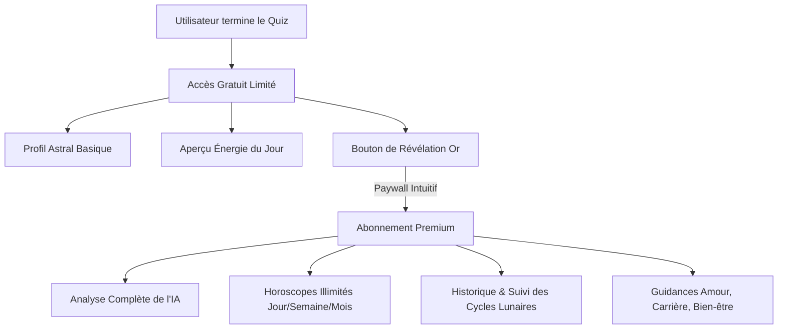
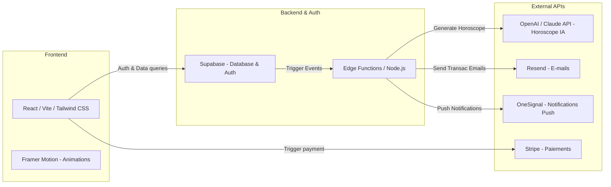
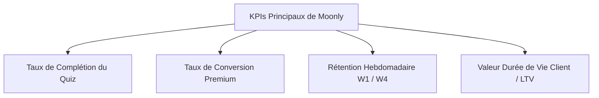

# Document de Conception Produit (PRD) — Moonly

> [!NOTE]
> **Moonly** est une webapp d’horoscope personnalisé par intelligence artificielle au positionnement ultra-premium. Conçue à l'origine comme une expérience web immersive, son architecture technique et son design sont optimisés pour une transition fluide vers des applications mobiles natives iOS et Android.

---

## 1. Vision & Positionnement Stratégique

### 1.1. La Vision Moonly
À l'intersection de la spiritualité millénaire et de l'intelligence artificielle générative de pointe, Moonly propose une approche renouvelée de l'astrologie. Loin des clichés et des horoscopes génériques des journaux, Moonly offre une guidance ultra-personnalisée, évolutive et intimement liée aux états émotionnels réels de l’utilisateur.

L'objectif est d'offrir une expérience de "bien-être spirituel moderne" (Spiritual Wellness), douce, introspective et haut de gamme. Moonly agit comme un miroir de l'âme et un compagnon quotidien pour naviguer dans la vie moderne avec plus de clarté.

### 1.2. Positionnement "Mystical Premium"
Moonly se distingue par une identité de marque et un design d’une élégance rare, baptisé **Mystical Premium**.



* **Le Light Mode Lunaire** : Contrairement à la majorité des applications d'astrologie qui imposent des thèmes sombres et lourds, Moonly prend le contre-pied avec un design lumineux, apaisant et épuré. Le fond oscille entre des blancs de lin et des crèmes de soie, évoquant la clarté bienveillante de la Lune.
* **Palette Chromatique** :
  * *Fond Principal* : Crème Sacrée (`#FAF8F5`) / Blanc Pur (`#FFFFFF`)
  * *Accents Principaux* : Violet Lunaire (`#6D5B97` / `#534370`), Bleu Nuit Mystique (`#1C2541`)
  * *Accents Secondaires* : Or Lunaire (`#D4AF37` / `#C5A059` en reflets subtils), Rose Poudré Cosmos (`#F4E8E1`)
* **Typographie** : Combinaison d'une police Serif prestigieuse (ex. *Playfair Display* ou *Cormorant Garamond*) pour les titres et d'une police Sans-Serif hautement lisible et géométrique (ex. *Inter* ou *Outfit*) pour les textes de lecture et les interfaces fonctionnelles.
* **Aérodynamisme Visuel (UI)** : Cartes arrondies en verre dépoli léger (Soft Glassmorphism), bordures extrêmement fines de couleur or ou violet très doux, ombres portées douces et diffuses, et absence totale de surcharge visuelle.

---

## 2. Identité Visuelle & Spécifications UI/UX

### 2.1. Charte Graphique & Palette de Couleurs (Tokens CSS)

| Token CSS | Teinte | Code Hex | Usage Principal |
| :--- | :--- | :--- | :--- |
| `--color-bg-lunar` | Crème Lunaire | `#FAF8F5` | Fond d'écran global de l'application |
| `--color-bg-card` | Blanc Crème | `#FFFFFF` | Fond des cartes interactives et des conteneurs |
| `--color-text-midnight`| Bleu Nuit | `#161C2E` | Titres principaux, lisibilité maximale |
| `--color-text-muted` | Violet Doux | `#6E6288` | Textes secondaires, sous-titres, descriptifs |
| `--color-accent-gold` | Or Céleste | `#D5B97C` | Détails, icônes décoratives, boutons actifs |
| `--color-gold-glow` | Or Doux | `#EAD8B1` | Effets de surbrillance, dégradés d'accentuation |
| `--color-border-gold` | Or Sablé | `#E8DFD0` | Bordures très fines (`1px`) des cartes |

### 2.2. Principes UX & Micro-Animations
1. **La Fluidité Absolue** : Toutes les transitions de pages et de cartes utilisent des courbes de bézier personnalisées (`cubic-bezier(0.25, 1, 0.5, 1)`) pour donner une sensation de légèreté et d'élasticité.
2. **Le Défilement Rituel** : Lors du passage d'une section à une autre (notamment dans le quiz), les éléments s'estompent et glissent doucement vers le haut (*fade-in slide-up*), créant un rythme méditatif.
3. **Reflets Dorés Dynamiques** : Les boutons d'action clés (comme le paywall ou la validation finale) possèdent un effet de reflet doré qui glisse sur le bouton de manière subtile toutes les 5 secondes.
4. **Chargement Astrologique** : Pendant la génération des résultats par l'IA, l'utilisateur voit une animation élégante représentant les phases de la Lune se succéder dans un halo doré, accompagnée de phrases d'introspection poétiques.

---

## 3. Le Quiz Immersif : L'Onboarding Holistique

Le quiz de Moonly n'est pas un simple formulaire administratif : c'est un **rituel d'onboarding**. Il comporte **environ 50 questions** structurées en 6 grandes étapes thématiques pour cartographier le profil complet de l'utilisateur.

```mermaid
polyline
    Etape 1: Identité Céleste --> Etape 2: Paysage Émotionnel --> Etape 3: Sphère Relationnelle --> Etape 4: Alignement & Carrière --> Etape 5: Confiance & Spiritualité --> Etape 6: Paramètres de Connexion
```

### 3.1. Structure Détaillée des 6 Étapes du Quiz

#### Étape 1 : L'Identité Céleste & Signature Vibratoire (9 questions)
*Objectif : Collecter les données astronomiques et numérologiques fondamentales pour le calcul de la carte du ciel et des vibrations numériques de naissance.*
1. **Comment doit-on vous appeler au quotidien ?** (Texte - Prénom d'usage)
2. **Quel est votre nom de naissance complet ?** (Texte - Tous les prénoms et nom de famille pour calculer les nombres numérologiques : Expression, Intime et Réalisation)
3. **Quel jour précis êtes-vous venu(e) au monde ?** (Sélecteur Date - indispensable pour le calcul astronomique et le Chemin de Vie)
4. **Connaissez-vous votre heure précise de naissance ?** (Boutons : Oui / Non, approximative / Je ne sais pas)
5. **Quelle est cette heure ?** (Sélecteur Heure - Affiché uniquement si "Oui" ou "Approximative")
6. **Dans quelle ville et pays vos yeux se sont-ils ouverts pour la première fois ?** (Saisie avec autocomplétion - pour le calcul exact de la latitude et longitude du thème astral)
7. **Quel est votre genre céleste de prédilection ?** (Boutons : Féminin / Masculin / Non-binaire / Autre / Préfère garder cela intime)
8. **Êtes-vous régulièrement interpellé(e) par des heures miroirs (ex: 11:11, 22:22) ou des suites de chiffres répétitives (777, 444) ?** (Boutons : Oui, quotidiennement / Parfois / Rarement / Non, je n'y prête pas attention)
9. **Quel chiffre unique, entre 1 et 9, a toujours résonné en vous ou suscité une attraction instinctive depuis votre enfance ?** (Sélecteur de chiffre de 1 à 9)

#### Étape 2 : Le Paysage Émotionnel & Météo Intérieure (8 questions)
*Objectif : Cartographier le niveau de stress, la gestion de l'anxiété et le niveau de conscience intérieure de l'utilisateur.*
10. **Quelle est l'émotion dominante dans votre esprit au réveil ces dernières semaines ?** (Boutons : Sérénité vibrante / Fatigue sourde / Anxiété diffuse / Élan créatif / Nostalgie douce)
11. **Sur une échelle de 1 à 5, comment évalueriez-vous la tension nerveuse accumulée en vous actuellement ?** (Curseur de 1 à 5 - de Calme Absolu à Tension Maximale)
12. **Face à un obstacle imprévu et déstabilisant, quelle est votre réaction réflexe immédiate ?** (Boutons : L'analyse logique froide / La vague de panique émotionnelle / L'action impulsive instantanée / Le besoin de retrait immédiat pour digérer)
13. **Où se réfugie votre esprit lorsque vos émotions débordent ?** (Boutons : Dans le silence et l'isolement complet / Auprès d'une oreille attentive et bienveillante / Dans une activité créative ou physique / Dans le sommeil et la distraction passive)
14. **À quel point vous sentez-vous connecté(e) à votre sagesse intuitive (votre "petite voix") ?** (Boutons : Fusion totale - je la suis toujours / Bonne complicité / Déconnexion fréquente - j'intellectualise trop / Rationnel(le) absolu(e))
15. **Comment décririez-vous la qualité vibratoire de votre sommeil récent ?** (Boutons : Profond, réparateur et peuplé de rêves / Agité, haché et interrompu / Trop court / Calme mais sans sensation de récupération)
16. **Quelle couleur symbolise le mieux votre météo intérieure du moment ?** (Boutons : Bleu Crépuscule (calme) / Jaune Solaire (énergie) / Violet Nébuleuse (intuition) / Vert Canopée (besoin d'ancrage) / Gris Brume (flou))
17. **À quelle fréquence vous accordez-vous un moment de pure solitude et d'introspection active ?** (Boutons : Chaque jour sans exception / 2 à 3 fois par semaine / Une fois par mois / Presque jamais, j'ai horreur du vide)

#### Étape 3 : Le Comportement Social & La Relation aux Autres (9 questions)
*Objectif : Analyser comment l'utilisateur interagit avec son entourage, gère ses limites et s'insère dans les dynamiques collectives.*
18. **Au sein d'un groupe, quel rôle adoptez-vous tout à fait naturellement ?** (Boutons : Le guide ou leader inspirant / Le médiateur harmonieux / L'observateur discret / L'animateur chaleureux et social)
19. **Lorsque votre "batterie sociale" est totalement épuisée, comment vous comportez-vous avec les gens ?** (Boutons : Je m'éclipse brusquement sans prévenir / Je deviens silencieux(se) et distant(e) / Je me force à sourire par politesse / Je m'irrite et perds patience facilement)
20. **Comment réagissez-vous face à la détresse émotionnelle d'un proche ?** (Boutons : L'éponge psychologique : j'absorbe sa douleur / Le solutionneur : je cherche des solutions concrètes / Le pilier : je reste fort(e) et stable sans m'impliquer personnellement / Le recul : je me protège en mettant de la distance)
21. **Quelle est votre plus grande difficulté dans vos relations humaines quotidiennes ?** (Boutons : Dire non et poser des limites claires / Faire confiance et baisser la garde / Exprimer clairement mes sentiments / Gérer l'hypocrisie ou la superficialité)
22. **Quelle attitude chez les autres brise instantanément votre confiance ?** (Boutons : La trahison ou le mensonge / Le manque de considération / L'égoïsme et le manque de partage / L'inconstance et le manque d'engagement)
23. **Quelle importance accordez-vous aux synchronicités et aux rencontres du destin ?** (Boutons : Cruciale - rien n'arrive par hasard / Intéressante mais je garde mon libre arbitre / Simple hasard curieux / Je ne crois qu'aux choix pragmatiques)
24. **Comment gérez-vous un conflit ouvert avec quelqu'un ?** (Boutons : Je cherche le dialogue constructif / Je me replie dans un silence punitif / Je défends vigoureusement ma position / Je fuis la confrontation à tout prix)
25. **De quelle manière exprimez-vous principalement votre affection et votre soutien ?** (Boutons : Par des paroles valorisantes / En offrant des moments exclusifs de qualité / En rendant des services concrets / Par des attentions matérielles / Par le contact physique et la présence)
26. **Quel type d'égrégore ou d'énergie humaine cherchez-vous à attirer dans votre entourage immédiat ?** (Boutons : Des esprits ambitieux et stimulants / Des âmes douces, créatives et spirituelles / Des esprits libres et aventureux / Des personnes stables, ancrées et fiables)

#### Étape 4 : L'Alignement Professionnel & Le Rapport à l'Abondance (8 questions)
*Objectif : Comprendre le positionnement professionnel, l'ambition, le rapport aux structures et les éventuels blocages liés à la réussite.*
27. **Comment se traduit votre situation professionnelle aujourd'hui ?** (Boutons : Salarié(e) corporate / Entrepreneur ou indépendant / Créatif(ve) libre / En transition ou reconversion / En recherche de sens ou d'activité)
28. **Quel est le principal moteur de votre ambition ?** (Boutons : L'impact profond et la transformation du monde / La liberté et l'autonomie de mon temps / La sécurité financière et matérielle / La reconnaissance et l'excellence sociale)
29. **Vous sentez-vous aligné(e) avec votre mission de vie professionnelle actuelle ?** (Boutons : Parfaitement sur mon chemin / Légère déviation / Perte totale de sens / En cours d'exploration active)
30. **Face à une hiérarchie ou un système d'autorité, quelle est votre posture par défaut ?** (Boutons : Collaboration fluide et respectueuse / Remise en question constructive / Rébellion silencieuse ou évitement / Insoumission affirmée)
31. **Comment qualifiez-vous votre relation actuelle avec l'argent et l'abondance ?** (Boutons : Relation fluide, confiante et abondante / Peur viscérale du manque et de l'insécurité / Culpabilité ou détachement excessif / Frustration face à des blocages invisibles)
32. **Le syndrome de l'imposteur fait-il partie de vos défis intérieurs au travail ?** (Boutons : Constamment, je doute de ma légitimité / Parfois, lors de nouveaux projets / Rarement / Jamais, je connais parfaitement ma valeur)
33. **Quel est votre plus grand blocage limitant dans l'expansion de vos projets professionnels ?** (Boutons : La peur de l'échec ou du jugement / La procrastination et le manque d'autodiscipline / La dispersion de mon attention / Le manque de clarté sur ma vision à long terme)
34. **Quel environnement de travail nourrit le plus votre créativité ?** (Boutons : L'effervescence collective stimulante / Le silence sacré et l'isolement complet / Un cadre naturel et apaisant / Une structure rigoureuse et organisée)

#### Étape 5 : L'Estime de Soi & Blessures de l'Âme (8 questions)
*Objectif : Analyser le rapport à soi-même, l'acceptation corporelle, les blessures d'enfance et les verrous inconscients.*
35. **Sur une échelle de 1 à 10, quel score attribuez-vous à votre amour-propre actuel ?** (Curseur de 1 à 10)
36. **Parmi ces cinq blessures de l'âme, laquelle résonne le plus douloureusement avec votre parcours ?** (Boutons : L'Abandon (peur de la solitude) / Le Rejet (peur de ne pas convenir) / L'Injustice (besoin de perfection) / La Trahison (besoin de contrôle) / L'Humiliation (peur de la honte))
37. **Lorsque vous vous regardez dans un miroir, quel est le premier sentiment qui émerge ?** (Boutons : La bienveillance et l'acceptation / Une critique immédiate sur un détail physique / Un détachement neutre / Une recherche d'alignement intérieur/extérieur)
38. **Quelle croyance limitante sabote le plus souvent vos élans personnels ?** (Boutons : "Je ne suis pas assez bien pour cela" / "C'est trop tard pour moi" / "Je vais finir par être déçu(e) ou abandonné(e)" / "Je ne mérite pas le bonheur total")
39. **Comment réagissez-vous face à vos propres erreurs ou échecs passés ?** (Boutons : Je me torture l'esprit pendant des semaines / J'analyse froidement pour apprendre / J'accepte avec douceur et compassion / J'essaie d'oublier au plus vite)
40. **Quel aspect de votre être intime souhaitez-vous le plus guérir ou développer ?** (Boutons : Ma capacité à m'aimer sans conditions / Mon courage pour passer à l'action / Ma sérénité face à l'inconnu / Ma connexion aux autres sans peur)
41. **Comment réagissez-vous lorsqu'on vous fait un compliment sincère ?** (Boutons : Je le minimise immédiatement par gêne / Je l'accepte avec gratitude et joie / Je doute secrètement de sa sincérité / Je me sens obligé(e) de rendre un compliment en retour)
42. **À quel point parvenez-vous à écouter et respecter les limites physiques de votre corps ?** (Boutons : J'écoute chaque signal avec déférence / Je ne l'écoute que lorsqu'il tombe malade / Je le pousse souvent au-delà de ses forces / J'ai du mal à décoder ses messages)

#### Étape 6 : Paramètres de Guidance & Célébration (8 questions)
*Objectif : Personnaliser le ton de l'IA, les heures de notification, les thématiques prioritaires et les modes de communication.*
43. **À quel moment de votre rituel quotidien souhaitez-vous recevoir votre guidance ?** (Boutons : Au lever du jour pour impulser mon énergie / À la pause méridionale pour me recentrer / Au crépuscule pour faire le bilan / De manière aléatoire au fil des astres)
44. **Quelles thématiques de vie souhaitez-vous voir traitées en priorité par l'IA ?** (Boutons : Amour & Harmonie Relationnelle / Alignement Professionnel & Succès / Paix Intérieure & Équilibre Mental / Cycles Lunaires & Rituels Spirituels)
45. **Quelle posture ou ton de guidance attendez-vous de notre intelligence artificielle ?** (Boutons : La Prêtresse Mystique (poétique, intuitive, métaphorique) / La Psychologue Astrologue (analytique, clinique, structurée) / L'Amie Bienveillante (douce, chaleureuse, accessible) / Le Mentor Spirituel (direct, inspirant, orienté action))
46. **Acceptez-vous de recevoir des notifications d'alerte lors des phases astrologiques intenses (ex: transits majeurs, éclipses, Mercure rétrograde) ?** (Boutons : Oui, je veux être alerté(e) immédiatement / Uniquement si l'impact est positif et harmonieux / Non, je préfère vivre dans l'instant présent)
47. **Quels canaux de transmission préférez-vous pour vos oracles ?** (Boutons : Notifications Push immersives / E-mail complet récapitulatif / Les deux pour un suivi optimal)
48. **Comment préférez-vous célébrer les soirs de Pleine Lune ?** (Boutons : Par un rituel d'écriture et de libération / Par une méditation silencieuse d'ancrage / En me connectant avec des proches / C'est une nuit normale pour moi)
49. **Comment avez-vous entendu parler de Moonly pour la première fois ?** (Boutons : Recommandation d'un proche / Réseaux sociaux célestes / Recherche Google / Autre chemin mystérieux)
50. **Dernier pas du rituel : où l'Oracle doit-il envoyer votre thème astral et votre analyse de Chemin de Vie ?** (Saisie texte E-mail)

---

## 4. Moteur d'IA & Génération des Résultats

Une fois les 50 questions complétées, le moteur d'IA de Moonly s'active. L’algorithme croise les calculs astronomiques de naissance (position des planètes, maisons, aspects) avec le nom de naissance complet pour la numérologie, et intègre les réponses psycho-comportementales obtenues lors du quiz.



### 4.1. Structure du Résultat Généré par l'IA

Chaque utilisateur reçoit un dossier astrologique et numérologique de très haute facture, découpé comme suit :

1. **Le Profil Énergétique Dominant** : Une analyse de l'élément prédominant (Feu, Terre, Air, Eau) basé non seulement sur la carte du ciel mais aussi sur le tempérament psycho-comportemental révélé dans le quiz.
2. **Le Chemin de Vie & L'Analyse Numérologique (Nouveauté)** :
   * *Le Chemin de Vie* : Déterminé par la somme réduite de la date de naissance complète (ex: $02/06/2026 \rightarrow 2+6+2+0+2+6 = 18 \rightarrow 1+8 = 9$). Fournit une description approfondie de la destinée céleste (avec prise en compte rigoureuse des Maîtres Nombres 11, 22 et 33).
   * *Le Nombre d'Expression* : Obtenu à partir de l'intégralité du nom de naissance (conversion des lettres en chiffres via la grille de Pythagore), détaillant les talents naturels et l'esprit de réalisation.
   * *Le Nombre Intime (Élan Spirituel)* : Calculé sur les voyelles, dévoilant les aspirations secrètes de l'âme de l'utilisateur.
   * *Le Nombre de Réalisation* : Calculé sur les consonnes, révélant la perception sociale extérieure de la personne.
   * *L'Année Personnelle* : Les tendances vibratoires numérologiques de l'année en cours pour orienter les décisions majeures.
3. **La Personnalité Astrologique** : Une synthèse moderne de la triade sacrée (Signe Solaire, Signe Lunaire et Ascendant) rédigée avec un ton haut de gamme et poétique.
4. **Les Forces Principales & Blocages Relationnels** : Identification bienveillante de 3 forces comportementales et de 2 verrous psycho-émotionnels (ex: blessure d'abandon réveillée par l'étape 5 ou schémas relationnels sous stress) avec exercices d'auto-coaching.
5. **Le Mois Favorable & Chiffre Porte-Bonheur** : Calculés dynamiquement selon les transits astrologiques et les cycles numérologiques annuels croisés.
6. **Le Conseil Personnalisé de l'Oracle** : Une guidance unique de 3 à 4 paragraphes, agissant comme un message canalisé pour guider l'utilisateur dans sa situation relationnelle et émotionnelle actuelle.
7. **L’Énergie du Jour & Aperçu de l'Horoscope Quotidien** : Une jauge d'énergie vibratoire (ex : 85% d'énergie d'ancrage aujourd'hui) suivie d'un court extrait de l'horoscope de la journée.

---

## 5. Modèle Économique : La Stratégie Freemium & Premium

Moonly fonctionne selon un modèle freemium très soigné. La frustration de l'utilisateur face à un mur de paiement (paywall) doit être évitée grâce à un apport de valeur immédiat et gratuit de très haute qualité.



### 5.1. Comparatif des Fonctionnalités : Gratuit vs Premium

| Fonctionnalité | Version Gratuite (Freemium) | Version Premium (Payante) |
| :--- | :---: | :---: |
| **Quiz Complet** | Oui | Oui |
| **Profil Énergétique Dominant** | Oui (Synthèse basique) | Oui (Analyse approfondie de 3 pages) |
| **Chemin de Vie & Numérologie** | Version simplifiée (Seulement le chiffre de Chemin de Vie) | Version complète (Chemin de vie détaillé, Expression, Intime, Réalisation, Année Personnelle) |
| **Triade Astrologique (Soleil/Lune/Asc)** | Oui (Signes uniquement) | Oui (Détail des maisons et aspects) |
| **Horoscope Quotidien** | Aperçu (50 premiers mots) | Complet & personnalisé par IA chaque matin |
| **Horoscope Hebdomadaire & Mensuel** | Non | Oui |
| **Forces & Blocages** | Floutés par un effet de verre | Entièrement débloqués avec exercices d'auto-coaching |
| **Chiffre Porte-Bonheur & Mois Favorable** | Oui | Oui |
| **Guidances Thématiques (Amour, Travail...)** | Non | Oui (Modules dédiés réactualisés) |
| **Suivi des Cycles Lunaires** | Basique (Phase actuelle) | Avancé (Impact de la lune sur le profil) |
| **Historique des Oracles** | Non | Oui (Sauvegarde illimitée) |
| **Notifications Push Ultra-Personnalisées** | Non | Oui (Selon l'heure choisie au quiz) |

### 5.2. Tarification Spécifique Premium
* **Abonnement Mensuel** : 9,99 € / mois (sans engagement).
* **Abonnement Annuel** : 59,99 € / an (soit 4,99 € / mois, l'option recommandée mise en avant).
* **Offre à vie (Lifetime)** : 149,99 € (pour les passionnés de spiritualité).

---

## 6. Architecture des Écrans (Dashboard & Navigation)

L'interface de Moonly privilégie le minimalisme pour favoriser l'apaisement. La navigation s'organise autour d'une barre de navigation inférieure (Tab Bar) à 4 onglets, idéale pour le futur portage mobile.

```
+-------------------------------------------------------------+
|  [Logo Moonly]                                [Mon Profil]  |
|                                                             |
|  "Bonjour Marie, la Lune Gibbeuse Croissante illumine       |
|   votre ciel aujourd'hui."                                  |
|                                                             |
|  +-------------------------------------------------------+  |
|  |                L'Énergie Céleste du Jour              |  |
|  |                 [ 88% - Créativité ]                  |  |
|  +-------------------------------------------------------+  |
|                                                             |
|  +-----------------------+       +-----------------------+  |
|  |  Mon Horoscope        |       |  Cycle de la Lune     |  |
|  |  [ Lire ma guidance ] |       |  [ Phase actuelle ]   |  |
|  +-----------------------+       +-----------------------+  |
|                                                             |
|  +-------------------------------------------------------+  |
|  |                 Mon Oracle Personnalisé               |  |
|  |  "Osez poser vos limites aujourd'hui..."              |  |
|  +-------------------------------------------------------+  |
|                                                             |
|  [ Accueil ]     [ Mon Thème ]     [ Cycles ]    [ Paramètres]  |
+-------------------------------------------------------------+
```

### 6.1. Description des 4 Onglets Principaux

#### 1. Accueil (Le Dashboard Lunaire)
* **Header** : Message d'accueil bienveillant mis à jour selon l'heure de la journée (ex : "Douce matinée, Marie") et affichage de la phase de la lune en cours sous forme de dessin vectoriel or minimaliste.
* **Widget "Énergie du Jour"** : Une jauge circulaire élégante indiquant le niveau vibratoire global et l'humeur astrale de la journée.
* **Section Horoscope** : Accès direct à l'horoscope du jour, de la semaine ou du mois (avec sélecteur à onglets horizontaux fluides).
* **L’Oracle Instantané** : Une carte d'affirmation positive quotidienne que l'utilisateur peut retourner virtuellement d'un clic en glissant le doigt (card flip animation).

#### 2. Mon Thème (La Carte du Ciel)
* **Représentation Graphique** : Un dessin épuré et moderne de la carte du ciel de naissance de l'utilisateur (simplifié pour éviter le côté trop technique et illisible des astrologues classiques).
* **Les Piliers Identitaires** : Analyse détaillée du Signe Solaire (l'égo), du Signe Lunaire (les émotions) et de l'Ascendant (le masque social).
* **Le Rapport de l'IA** : L'accès direct à l'analyse complète générée suite au quiz (Forces, Blocages, Conseils d'alignement).

#### 3. Cycles Lunaires & Guidance
* **Calendrier Lunaire** : Un calendrier minimaliste indiquant les lunaisons futures (Pleine Lune, Nouvelle Lune) et leurs transits dans les différents signes.
* **Rituel de Lune** : Des conseils d'écriture ou de méditation rédigés par l'IA spécifiquement adaptés à l'impact de la phase lunaire en cours sur le profil de l'utilisateur.

#### 4. Paramètres & Espace Premium
* **Gestion du Profil** : Modification des heures de naissance, du prénom ou des coordonnées de contact.
* **Abonnement** : Espace clair de gestion de l'abonnement Premium, factures, et méthodes de paiement Stripe sécurisées.
* **Préférences d'Alertes** : Activation fine des notifications push quotidiennes et hebdomadaires.

---

## 7. Spécifications Techniques & Stack Recommandée

Pour garantir un chargement instantané, un rendu visuel parfait et une transition aisée vers des applications mobiles hybrides (React Native ou Flutter), la stack suivante est recommandée :



### 7.1. Détail de la Stack Technique

* **Framework Core** : **React (avec Vite)** pour une Single Page Application (SPA) moderne, légère et ultra-rapide. L'utilisation de Vite garantit des builds instantanés et un temps de chargement minimal, offrant une expérience fluide indispensable pour une webapp premium. Ce socle React standard facilite grandement le portage de la logique métier (hooks, state management) vers React Native.
* **Styling & UI** : **Tailwind CSS** combiné avec des variables CSS natives pour piloter facilement la charte Mystical Premium et un éventuel basculement de mode de couleur.
* **Base de Données & Authentification** : **Supabase** (PostgreSQL). Offre une gestion native des utilisateurs (Auth), une base de données relationnelle sécurisée pour stocker les profils astrologiques complexes, et des fonctions Edge performantes.
* **Moteur d'IA** : Intégration de l'API **Claude (Anthropic)** ou **OpenAI (GPT-4o)** via des serveurs sécurisés pour la génération à la demande et le traitement par batch des horoscopes ultra-personnalisés.
* **Passerelle de Paiement** : **Stripe** pour la gestion sécurisée des abonnements web (avec Stripe Billing et portail client intégré).
* **Mailing transactionnel** : **Resend** pour sa rapidité et sa délivrabilité exceptionnelle, idéal pour l'envoi des bilans hebdomadaires et des e-mails d'onboarding.
* **Notifications Push & In-App** : **OneSignal** ou **Firebase Cloud Messaging (FCM)** pour gérer la communication cross-plateforme (Web Push + Futures Apps iOS/Android).
* **Hébergement & Déploiement** : **Vercel** ou **Netlify** pour l'hébergement statique du bundle React, assurant une distribution CDN mondiale ultra-rapide.
* **Analytics & Product Insights** : **PostHog** pour analyser le comportement des utilisateurs sur le quiz, mesurer le taux d'abandon à chaque étape, et optimiser le taux de conversion du paywall.

### 7.2. Structure des Données (Schéma PostgreSQL Conceptuel)

```sql
-- Table des Utilisateurs
CREATE TABLE users (
    id UUID PRIMARY KEY DEFAULT gen_random_uuid(),
    email VARCHAR(255) UNIQUE NOT NULL,
    first_name VARCHAR(100),
    created_at TIMESTAMP WITH TIME ZONE DEFAULT CURRENT_TIMESTAMP,
    avatar_url TEXT
);

-- Table des Profils Astrologiques et Numérologiques (Générés post-quiz)
CREATE TABLE astro_profiles (
    id UUID PRIMARY KEY DEFAULT gen_random_uuid(),
    user_id UUID REFERENCES users(id) ON DELETE CASCADE,
    full_birth_name VARCHAR(255), -- Requis pour l'analyse du nom complet en numérologie
    birth_date DATE NOT NULL,
    birth_time TIME,
    birth_place VARCHAR(255) NOT NULL,
    latitude DECIMAL(9,6),
    longitude DECIMAL(9,6),
    sun_sign VARCHAR(50),
    moon_sign VARCHAR(50),
    ascendant_sign VARCHAR(50),
    dominant_element VARCHAR(50),
    life_path_number INT, -- Numérologie: Chemin de Vie (1-9, ou maîtres nombres 11, 22, 33)
    expression_number INT, -- Numérologie: Nombre d'Expression
    soul_urge_number INT, -- Numérologie: Nombre Intime (élan spirituel)
    personality_number INT, -- Numérologie: Nombre de Réalisation
    personal_year_number INT, -- Numérologie: Année Personnelle active
    ai_analysis JSONB, -- Contient le texte complet des forces/blocages générés
    created_at TIMESTAMP WITH TIME ZONE DEFAULT CURRENT_TIMESTAMP
);

-- Table des Réponses du Quiz
CREATE TABLE quiz_responses (
    id UUID PRIMARY KEY DEFAULT gen_random_uuid(),
    user_id UUID REFERENCES users(id) ON DELETE CASCADE,
    responses JSONB NOT NULL, -- Tableau clé/valeur des 50 questions
    completed_at TIMESTAMP WITH TIME ZONE DEFAULT CURRENT_TIMESTAMP
);

-- Table des Abonnements (Synchronisée avec Stripe)
CREATE TABLE subscriptions (
    id UUID PRIMARY KEY DEFAULT gen_random_uuid(),
    user_id UUID REFERENCES users(id) ON DELETE CASCADE,
    stripe_subscription_id VARCHAR(255) UNIQUE,
    status VARCHAR(50) NOT NULL, -- active, trialing, canceled, past_due
    price_id VARCHAR(100),
    current_period_end TIMESTAMP WITH TIME ZONE,
    updated_at TIMESTAMP WITH TIME ZONE DEFAULT CURRENT_TIMESTAMP
);

-- Table des Guidances Quotidiennes (Historique d'horoscope)
CREATE TABLE daily_guidances (
    id UUID PRIMARY KEY DEFAULT gen_random_uuid(),
    user_id UUID REFERENCES users(id) ON DELETE CASCADE,
    guidance_date DATE NOT NULL,
    energy_score INT, -- Score sur 100 de l'énergie du jour
    energy_label VARCHAR(100), -- ex: "Créativité", "Ancrage"
    horoscope_text TEXT NOT NULL,
    oracle_card_text TEXT,
    created_at TIMESTAMP WITH TIME ZONE DEFAULT CURRENT_TIMESTAMP,
    UNIQUE(user_id, guidance_date)
);
```

---

## 8. Sécurité, RGPD & Confidentialité des Données

> [!WARNING]
> La collecte de données personnelles intimes comme les ressentis émotionnels, la situation amoureuse ou les doutes professionnels implique une responsabilité éthique et légale maximale. Moonly doit être irréprochable sur la protection des données.

1. **Consentement Éclairé** : À l'étape 6 du quiz (avant la collecte de l'e-mail), l'utilisateur doit explicitement valider une case à cocher d'acceptation de la politique de confidentialité des données sensibles (données de santé mentale/émotionnelle).
2. **Minimisation des Données** : Les réponses détaillées du quiz (les 50 questions) sont chiffrées en base de données. Elles ne servent qu'à nourrir le prompt de génération de l'IA et ne sont en aucun cas vendues ou partagées avec des tiers.
3. **Traitement IA Anonymisé** : Lors de l'envoi des données à l'API de traitement d'intelligence artificielle (Claude ou OpenAI), le nom et l'e-mail de l'utilisateur sont entièrement purgés. L'IA ne reçoit que l'âge, les données de naissance et le tableau des réponses anonymes.
4. **Droit à l'Oubli Facilité** : Un bouton simple dans les paramètres de l'application permet à l'utilisateur de supprimer définitivement et instantanément l'intégralité de son profil, de ses réponses de quiz et de ses historiques de guidances de la base de données PostgreSQL.

---

## 9. Stratégie de Lancement & Roadmap Produit

### Phase 1 : Le MVP Web Immersif (Mois 1 - 2)
* **Objectifs** : Valider l'attraction du produit et optimiser le taux de conversion du tunnel d'onboarding.
* **Livrables** : Webapp responsive avec le quiz complet de 50 questions, le rendu de l'IA fluide et le paywall d'abonnement Stripe.
* **Stratégie d'acquisition** : Partenariats avec des créateurs de contenu bien-être/ésotérisme sur Instagram et TikTok.

### Phase 2 : Rétention & Consolidation (Mois 3 - 4)
* **Objectifs** : Améliorer le taux d'engagement au-delà de la première semaine d'utilisation.
* **Livrables** : Intégration du calendrier lunaire avancé, système de rituels guidés personnalisés et mise en place des notifications hebdomadaires de synthèse par e-mail via Resend.

### Phase 3 : L'Expansion Mobile Hybride (Mois 5 - 6)
* **Objectifs** : Occuper les boutiques d'applications iOS et Android pour s'intégrer dans le quotidien de l'utilisateur via les widgets de l'écran d'accueil du téléphone.
* **Livrables** : Lancement de l'application mobile développée avec React Native (permettant de réutiliser plus de 80% du code logique React et des styles de la webapp).

---

## 10. Indicateurs de Succès & KPIs Clés

Pour mesurer la performance et la viabilité économique de Moonly, l'équipe produit analysera en permanence les indicateurs suivants sur le tableau de bord PostHog :



1. **Taux de Complétion du Quiz (Onboarding Funnel)** : Le pourcentage d'utilisateurs qui commencent la question 1 et atteignent la question 50. La cible visée est de **> 65%** grâce à l'UX rituelle et fluide.
2. **Taux de Conversion Paywall (Free-to-Paid)** : Le pourcentage de profils qualifiés qui souscrivent à l'une des formules Premium après avoir vu leur aperçu gratuit. La cible visée est de **3.5% à 5%**.
3. **Rétention Hebdomadaire (W1 / W4 Retention)** : Le pourcentage d'utilisateurs qui reviennent ouvrir l'application chaque semaine. Un taux de **> 40% à W4** témoigne d'un produit indispensable au quotidien de l'utilisateur.
4. **LTV (Lifetime Value) / CAC (Customer Acquisition Cost)** : Le ratio de santé économique. La valeur générée par un abonné dans le temps doit être au moins **3 fois supérieure** au coût d'acquisition marketing requis pour le faire entrer dans l'application (`LTV / CAC > 3`).
